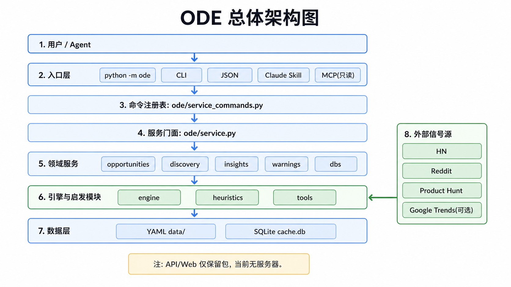
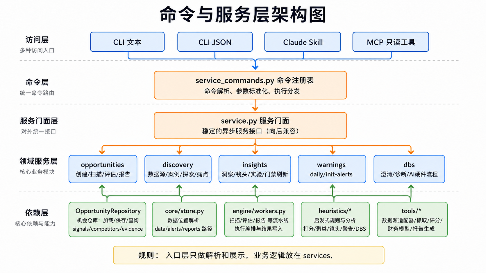
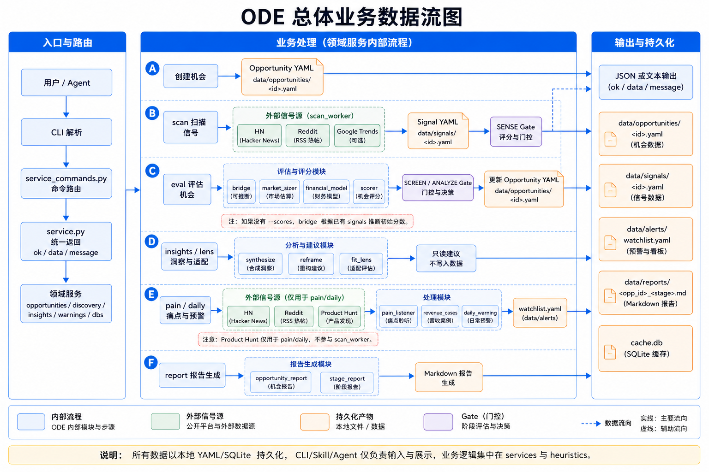
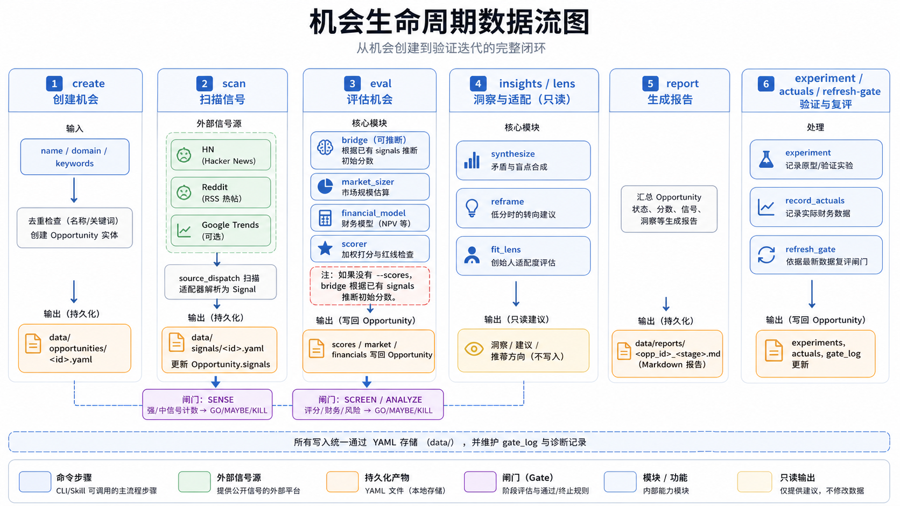
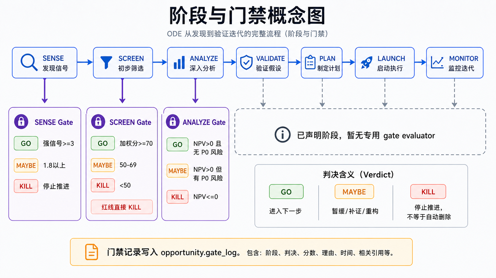

# ODE - Opportunity Discovery Engine

ODE is a local, file-backed opportunity discovery toolkit. It helps an operator or agent turn vague market directions into auditable opportunities, signals, scores, warnings, diagnostics, and reports.

The primary product is a Python CLI plus service layer. The repo also includes an optional local browser UI under [web](./web), kept outside the runtime package and wired only through shared service commands. [ode/api](./ode/api) and [ode/web](./ode/web) are reserved package directories only.

## Current Truth

- Runtime package: [ode](./ode).
- Main entry point: `python -m ode ...` through [ode/__main__.py](./ode/__main__.py), or installed script `ode ...`.
- CLI implementation: [ode/cli.py](./ode/cli.py), [ode/cli_parser.py](./ode/cli_parser.py), [ode/cli_handlers.py](./ode/cli_handlers.py), [ode/cli_json.py](./ode/cli_json.py).
- Public service facade: [ode/service.py](./ode/service.py).
- Actual service implementations: [ode/services](./ode/services).
- Shared command registry: [ode/service_commands.py](./ode/service_commands.py); CLI JSON mode, Claude Skill, and MCP should route through it.
- Optional local web UI: [web](./web), installed separately and tested through [web/tests](./web/tests).
- Persistence: YAML files under local `data/`, with a small SQLite cache at `data/cache.db`.
- Data root: `ODE_ROOT` if set; otherwise the current checkout when running inside the repo; otherwise the installed package checkout; finally `~/opportunity-engine`.
- Automated scan sources today: Hacker News, Reddit RSS, optional Google Trends. Pain listening also uses Product Hunt as solution-side launch evidence.
- Tests collected on 2026-05-18: 234.

## Quick Start

```bash
python -m pip install -r requirements.txt
python tools/check_environment.py
python -m ode status
```

Open-ended discovery:

```bash
python -m ode sources --region global
python -m ode sources --region china
python -m ode cases --region china --min-grade B
python -m ode pain --reddit "SaaS,SideProject,microsaas,webdev" --hn-top 50 --min-grade D
python -m ode explore --hn-top 50 --reddit "startup,SaaS,Entrepreneur,sideproject"
```

Opportunity workflow:

```bash
python -m ode create --name "AI Tutor" --domain education --keywords "AI,tutoring,personalized"
python -m ode scan --opp-id <opp_id> --hn-top 30 --reddit "edtech,learnprogramming"
python -m ode eval <opp_id> --tam 5000000000 --arpu 29.99
python -m ode insights <opp_id>
python -m ode lens <opp_id> --profile examples/profiles/open_founder_profile.json
python -m ode report <opp_id> --stage screen --print
```

Machine-readable mode:

```bash
python -m ode --json status
python -m ode --json sources --region global
python -m ode --json cases --min-grade C --top 5
```

## 项目结构与文件索引

下面只列出理解项目所需的关键文件和目录。构建产物、缓存、运行时数据、临时文件和生成文件不在这里展开。

| 路径 | 新手应该知道什么 |
|---|---|
| [pyproject.toml](./pyproject.toml) | Python 包元数据、`ode` 命令入口和 pytest 默认配置。 |
| [requirements.txt](./requirements.txt) | 运行和测试所需的基础依赖。 |
| [ode/__main__.py](./ode/__main__.py) | `python -m ode` 的入口，直接调用 CLI `main()`。 |
| [ode/cli.py](./ode/cli.py) | CLI 最外层入口，负责配置输出编码、解析参数并分发命令。 |
| [ode/cli_parser.py](./ode/cli_parser.py) | 定义所有命令和参数，例如 `create`、`scan`、`eval`、`daily`。 |
| [ode/cli_handlers.py](./ode/cli_handlers.py) | 人类可读的命令行输出层，负责把服务结果格式化成文本。 |
| [ode/cli_json.py](./ode/cli_json.py) | `--json` 模式入口，输出 `ok/data/message` 结构，方便 Agent 或脚本消费。 |
| [ode/service_commands.py](./ode/service_commands.py) | 统一命令注册表，把 CLI/Skill/MCP 的参数转成服务层调用。 |
| [ode/service.py](./ode/service.py) | 对外稳定的异步服务门面，保留历史导入路径并转发到 [ode/services](./ode/services)。 |
| [ode/services](./ode/services) | 领域服务实现目录，业务逻辑按机会、发现、洞察、预警、DBS 拆分。 |
| [ode/services/opportunities.py](./ode/services/opportunities.py) | 机会创建、列表、展示、扫描、评估、报告、组合视图。 |
| [ode/services/discovery.py](./ode/services/discovery.py) | 数据源目录、赚钱案例、开放探索、痛点监听。 |
| [ode/services/insights.py](./ode/services/insights.py) | 洞察、Founder Fit Lens、实验记录、实际财务数据、门禁刷新。 |
| [ode/services/warnings.py](./ode/services/warnings.py) | 每日预警、初始预警系统、watchlist 持久化。 |
| [ode/services/dbs.py](./ode/services/dbs.py) | DBS 澄清、诊断、概念拆解和 AI 硬件工作流。 |
| [ode/engine](./ode/engine) | 机会流水线核心：worker、gate、pipeline、portfolio。 |
| [ode/engine/workers.py](./ode/engine/workers.py) | `scan_worker`、`eval_worker`、`report_worker`，是真正执行扫描/评估/报告的异步函数。 |
| [ode/engine/gate.py](./ode/engine/gate.py) | `SENSE`、`SCREEN`、`ANALYZE` 阶段的 GO/MAYBE/KILL 判定规则。 |
| [ode/engine/pipeline.py](./ode/engine/pipeline.py) | 声明 7 阶段机会流程：`SENSE -> SCREEN -> ANALYZE -> VALIDATE -> PLAN -> LAUNCH -> MONITOR`。 |
| [ode/core](./ode/core) | 核心模型、YAML 存储、仓库边界、评分适配和生成物治理。 |
| [ode/core/models.py](./ode/core/models.py) | 定义 `Opportunity`、`Signal`、`Competitor`、`Evidence`、`WorkerResult`。 |
| [ode/core/store.py](./ode/core/store.py) | YAML 文件读写和数据根目录解析，运行时数据默认落在 `data/`。 |
| [ode/core/repository.py](./ode/core/repository.py) | 机会仓库封装，提供按 id/name 查询和重复机会检测。 |
| [ode/core/scoring.py](./ode/core/scoring.py) | 把评分器结果写回 `Opportunity.scores`。 |
| [ode/core/artifacts.py](./ode/core/artifacts.py) | 生成报告、地图、文档前的写入冲突判断工具。 |
| [ode/heuristics](./ode/heuristics) | 启发式分析模块，例如探索、评分桥接、痛点监听、赚钱案例、DBS、每日预警。 |
| [ode/heuristics/bridge.py](./ode/heuristics/bridge.py) | 当 `eval` 没有传 `--scores` 时，根据已有 signals 推断初始评分。 |
| [ode/heuristics/pain_listener.py](./ode/heuristics/pain_listener.py) | 将 HN/Reddit/Product Hunt 等信号转成痛点等级和验证队列。 |
| [ode/heuristics/revenue_cases.py](./ode/heuristics/revenue_cases.py) | 对赚钱案例做 A-E 证据评级、进入适配度和验证动作分析。 |
| [ode/heuristics/daily_warning.py](./ode/heuristics/daily_warning.py) | 把 pain/cases/explore 结果合并成 `New Spark`、`Watch`、`Validate Soon`、`Act Now`。 |
| [ode/tools](./ode/tools) | 数据源适配、趋势扫描、市场估算、财务模型、机会评分、报告生成等工具函数。 |
| [ode/tools/source_registry.py](./ode/tools/source_registry.py) | 读取 [sources/opportunity_sources.yaml](./sources/opportunity_sources.yaml) 并标记哪些源会被 worker 使用。 |
| [ode/tools/source_dispatch.py](./ode/tools/source_dispatch.py) | 按 `scan_worker`、`explore`、`pain_listener` 等上下文调用对应数据源适配器。 |
| [ode/tools/sources](./ode/tools/sources) | 真实运行的数据源适配器：HN、Reddit、Product Hunt、Google Trends。 |
| [sources/opportunity_sources.yaml](./sources/opportunity_sources.yaml) | 数据源注册表，包含 active、optional、manual、planned、utility 多种状态。 |
| [examples/revenue_cases/seed_cases.json](./examples/revenue_cases/seed_cases.json) | 默认赚钱案例库，用于 `ode cases` 和预警系统。 |
| [examples/profiles/open_founder_profile.json](./examples/profiles/open_founder_profile.json) | Founder Fit Lens 的示例用户画像。 |
| [flows/opportunity_7stage.yaml](./flows/opportunity_7stage.yaml) | 外部可读的 7 阶段机会流程定义。 |
| [schemas/opportunity_import_flow.schema.json](./schemas/opportunity_import_flow.schema.json) | 导入外部机会分析材料时使用的 JSON Schema。 |
| [ode/imports/detector_integration.py](./ode/imports/detector_integration.py) | 将 [imports/opportunity-detector](./imports/opportunity-detector) 审计材料转换成 ODE 导入计划。 |
| [ode/integrations/claude_skill.py](./ode/integrations/claude_skill.py) | Claude Code `/ode` 命令集成。 |
| [ode/integrations/mcp_server.py](./ode/integrations/mcp_server.py) | MCP 只读工具注册，目前不暴露写入型工具。 |
| [web](./web) | 可选本地浏览器 UI，不进入 `ode` 包；通过 `ode.service_commands` 调用核心能力。 |
| [web/bridge.py](./web/bridge.py) | Web 层到服务命令注册表的薄桥接。 |
| [tests](./tests), [web/tests](./web/tests) | pytest 测试入口，覆盖 CLI、服务边界、数据源、启发模块、DBS、预警、导入契约和可选 Web 桥接。 |
| [tools/check_environment.py](./tools/check_environment.py) | 检查仓库运行所需的关键文件是否存在。 |
| [tools/validate_import_integration.py](./tools/validate_import_integration.py) | 校验导入契约和 golden 输出。 |

不需要从 `data/` 开始读项目。`data/` 是本地运行时状态目录，默认被 Git 忽略，里面存机会、信号、报告、预警状态和缓存。

## 总体架构图

这张图先帮助你把 ODE 看成一个本地 CLI/服务层系统，而不是传统 Web 前后端项目。



图中的外部信号源不是常驻服务。它们只在对应命令运行时由 `tools` 层按需抓取。

## 模块架构拆解

### 命令与服务层架构图

这张图展示 CLI、JSON、Claude Skill、MCP 如何汇入同一个命令注册表，再进入服务门面和领域服务。



核心规则是：入口层只负责参数解析和展示，业务逻辑放在 [ode/services](./ode/services)、[ode/engine](./ode/engine)、[ode/heuristics](./ode/heuristics) 和 [ode/tools](./ode/tools) 中。

## 总体业务数据流图

这张图展示一次用户命令或 Agent 调用进入系统后，如何经过路由、服务、业务模块、外部信号源和本地 YAML/SQLite 持久化。



推断关系：图中的“用户 / Agent -> CLI/Skill/MCP”表示项目暴露的使用入口，具体 Agent 如何触发取决于外部运行环境；从 `service_commands.py` 往后的调用链、数据写入路径和外部数据源上下文均来自真实代码。

## 关键业务流程拆解

### 机会生命周期数据流图

这张图聚焦 ODE 的主业务闭环：创建机会、扫描信号、评估打分、生成洞察、输出报告，再通过实验和实际数据复评。



需要特别注意：`insights` 和 `lens` 是只读建议，不会直接修改机会；`experiment`、`record-actuals`、`refresh-gate` 才会把验证数据或门禁记录写回机会。

## 难点概念图解

### 阶段与门禁

ODE 的机会不是一次性给出“好/坏”，而是沿阶段推进。前三个阶段有真实 gate evaluator，后面的 `VALIDATE`、`PLAN`、`LAUNCH`、`MONITOR` 目前只是已声明阶段。



`KILL` 在代码中主要表现为 worker 返回 `next_action="kill"`；它表示停止推进当前判断，不等于一定会自动删除机会或改写 `Opportunity.status`。

## 关键概念速读

| 概念 | 新手解释 | 关键代码 |
|---|---|---|
| Opportunity | 一个被跟踪的商业机会，包含阶段、状态、分数、市场、财务、信号、实验和诊断记录。 | [ode/core/models.py](./ode/core/models.py) |
| Signal | 从 HN、Reddit、Google Trends 或人工记录来的信号，会被链接到某个 Opportunity。 | [ode/core/models.py](./ode/core/models.py), [ode/engine/workers.py](./ode/engine/workers.py) |
| Gate | 阶段门禁，给出 `GO`、`MAYBE`、`KILL`。 | [ode/engine/gate.py](./ode/engine/gate.py) |
| WorkerResult | worker 的统一返回对象，包含状态、分数、产物、下一步动作和原始数据。 | [ode/core/models.py](./ode/core/models.py) |
| Service Result | 服务层统一返回 `{"ok": bool, "data": dict, "message": str}`，便于 CLI、JSON、Skill、MCP 共用。 | [ode/services/result.py](./ode/services/result.py) |
| Command Registry | 所有命令的共享路由表，减少 CLI、Skill、MCP 各写一套逻辑。 | [ode/service_commands.py](./ode/service_commands.py) |
| Source Registry | 数据源目录，不等于“都会被自动扫描”。只有带 runtime context 的源才会被对应命令调用。 | [sources/opportunity_sources.yaml](./sources/opportunity_sources.yaml), [ode/tools/source_registry.py](./ode/tools/source_registry.py) |
| Bridge | 当没有人工评分时，根据已有 signal、市场和财务数据推断初始分数。 | [ode/heuristics/bridge.py](./ode/heuristics/bridge.py) |
| DBS Diagnostic | 商业澄清和诊断记录；只有使用 `--save` 时才会写进机会。 | [ode/heuristics/dbs.py](./ode/heuristics/dbs.py), [ode/services/dbs.py](./ode/services/dbs.py) |
| Watchlist | 每日预警系统维护的候选方向状态，不是 Opportunity 本体。 | [ode/heuristics/daily_warning.py](./ode/heuristics/daily_warning.py), [ode/services/warnings.py](./ode/services/warnings.py) |

## CLI Commands

| Command | Mutates ODE state | Purpose |
|---|---:|---|
| `create` | yes | Create an opportunity, with duplicate checks by name and keyword overlap. |
| `list` | no | List stored opportunities. |
| `show` | no | Show one opportunity by id or name, including latest DBS diagnostic. |
| `scan` | yes | Collect signals and attach them to an opportunity. |
| `eval` | yes | Score and gate an opportunity; can infer scores from signals when `--scores` is absent. |
| `report` | yes | Write a Markdown report under `data/reports/`. |
| `status` | no | Show opportunity counts and cache stats. |
| `sources` | no | List configured source registry entries. |
| `cases` | no | Analyze revenue-proven reference cases. |
| `dbs` | optional | Run the DBS diagnostic chain; `--save` persists a diagnostic. |
| `clarify` | optional | Clarify a fuzzy commercial goal; `--save` persists a diagnostic. |
| `diagnose` | optional | Diagnose business-machine facts for an opportunity; `--save` persists a diagnostic. |
| `deconstruct` | optional | Deconstruct fuzzy business terms; `--save` persists a diagnostic. |
| `ai-hardware` | no | Show the map-first AI hardware opportunity workflow. |
| `portfolio` | no | Rank stored opportunities by stored weighted score. |
| `compare` | no | Compare selected opportunities side by side. |
| `explore` | no | Cluster public signals into opportunity hypotheses. |
| `pain` | no | Rank pain signals and validation queues. |
| `daily` | yes | Update warning state and write a daily report. |
| `init-alerts` | yes | Bootstrap warning priors from revenue cases. |
| `insights` | no | Run synthesis, quick assessment, reframe, and latest DBS lookup. |
| `lens` | no | Apply Founder Fit Lens without mutating the opportunity. |
| `experiment` | yes | Record a prototype or validation iteration. |
| `record-actuals` | yes | Record actual financial values. |
| `refresh-gate` | yes | Re-evaluate a gate from current state. |

## Source Registry

The source catalog lives in [sources/opportunity_sources.yaml](./sources/opportunity_sources.yaml). At this audit pass it contains 66 entries:

| Status | Count | Meaning |
|---|---:|---|
| `active` | 3 | Runtime source with an adapter and declared context. |
| `optional` | 1 | Runtime-capable only when optional dependency/input exists. |
| `manual` | 11 | Human-curated signal path. |
| `planned` | 50 | Listed for coverage planning, not scanned. |
| `utility` | 1 | Helper source, not a scan context today. |

Context truth:

- `scan_worker`: `hackernews_topstories`, `reddit_hot_rss`, optional `google_trends`.
- `explore`: `hackernews_topstories`, `reddit_hot_rss`, optional `google_trends`.
- `pain_listener`: `hackernews_topstories`, `reddit_hot_rss`, `producthunt_feed`.

Do not infer that ODE scans all registered sources. `contexts` and `used_by_scan_workers` are the operational truth.

## Data And Artifacts

```text
data/
  opportunities/     # Opportunity YAML entities
  signals/           # Signal YAML entities
  competitors/       # Competitor YAML entities
  evidence/          # Evidence YAML entities
  alerts/            # warning watchlist and case priors
  reports/           # generated Markdown reports
  cache.db           # local SQLite cache
```

`data/` content is user-specific runtime state and is ignored by Git. Generated reports, renders, validation plans, and maps should use [ode/core/artifacts.py](./ode/core/artifacts.py) before overwriting or versioning files.

## Integrations

| Integration | Status | Notes |
|---|---|---|
| CLI | active | [ode/cli.py](./ode/cli.py) stays thin over parser, handlers, and JSON mode. |
| JSON mode | active | Uses [ode/service_commands.py](./ode/service_commands.py) for registered commands. |
| Claude Skill | active | `/ode` handler routes registered commands through the shared registry. |
| MCP | partial | Registers read-only service tools only. |
| project-tracker | bridge exists | Promotion bridge exists, but normal ODE workflows do not require it. |
| Public REST/API | deferred | No packaged API server is shipped under `ode/`; local web endpoints are UI adapters only. |
| Local Web UI | optional | [web](./web) runs with separate dependencies and calls only `service_commands`. |

## Tests

```bash
python tools/check_environment.py
python tools/validate_import_integration.py
python -m pytest
```

Optional local Web smoke, after installing [web/requirements.txt](./web/requirements.txt):

```bash
python tools/check_web_app.py
```

The collected suite currently covers CLI surfaces, service boundaries, source registry dispatch, revenue cases, pain listening, daily warnings, DBS Lens, AI hardware workflow, import integration, project structure, artifact governance, optional Web bridge/run/smoke behavior, and storybook prototype contracts.

## Documentation Map

- [ARCHITECTURE.md](./ARCHITECTURE.md): authoritative architecture and data flow.
- [docs/00-navigation.md](./docs/00-navigation.md): documentation index and source-code map.
- [docs/03-project-structure.md](./docs/03-project-structure.md): repository boundaries and cleanup rules.
- [docs/04-data-sources.md](./docs/04-data-sources.md): source registry truth and runtime scan limits.
- [docs/05-revenue-cases.md](./docs/05-revenue-cases.md): revenue evidence grades and warning gates.
- [docs/06-dbs-lens.md](./docs/06-dbs-lens.md): DBS Lens contract and license boundary.
- [docs/08-ai-hardware-dbs-workflow.md](./docs/08-ai-hardware-dbs-workflow.md): AI hardware scan workflow.
- [docs/09-opportunity-scan-quality-contract.md](./docs/09-opportunity-scan-quality-contract.md): quality bar for generated opportunity scans.

Domain research documents and rendered assets under [docs](./docs) are useful artifacts, but they are not the source of truth for runtime architecture.

## License

MIT
