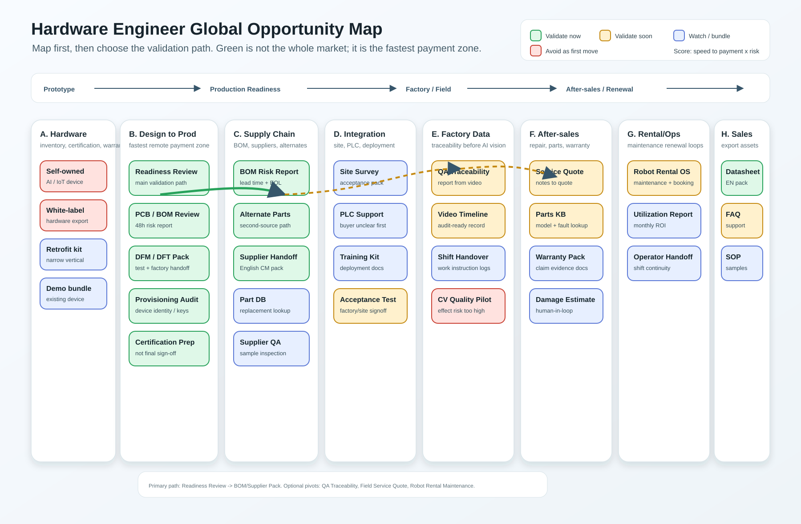
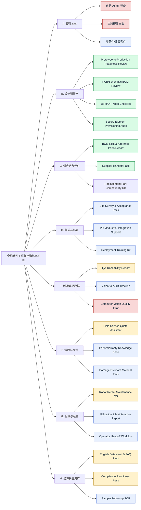
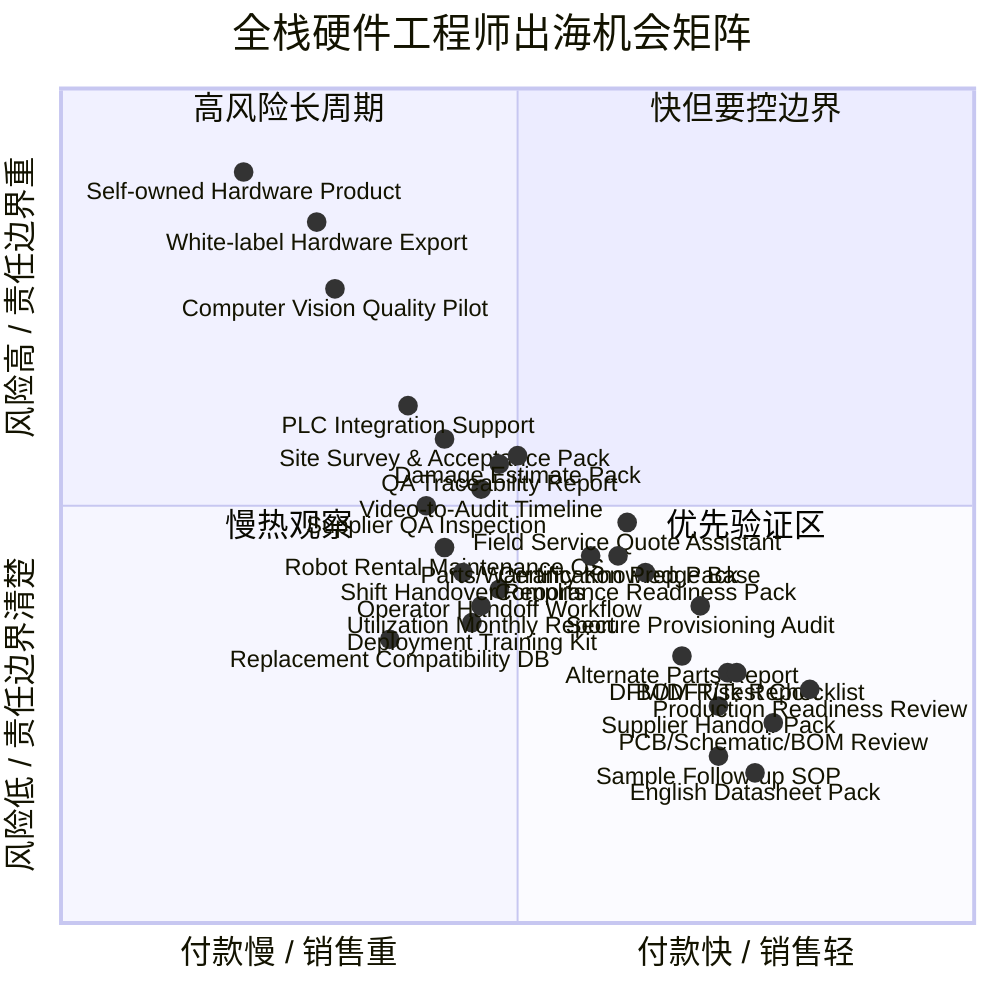

<!-- Generated by ODE -->
# 全栈硬件工程师出海机会扫描

副标题：不要先卖“硬件产品”，先卖海外买家会付钱的硬件工作流  
版本：v2 系统修复版  
生成时间：2026-05-14  
读者：能做 PCB / 嵌入式 / 固件 / 测试 / DFM / 供应链沟通 / 英文交付的全栈硬件工程师  
目标：在 7-30 天内找到可收费的海外机会，而不是做一份泛泛的行业趋势报告

---

## 1. 先给结论

如果你是一个全栈硬件工程师，想从中国供应链和工程能力切入海外市场，最值得立即验证的不是“做一个硬件产品卖出去”，而是：

> 把硬件工程经验拆成可远程交付、可固定报价、可在 7 天内要求付款的工作流服务。

首选切入口是：

## Prototype-to-Production Readiness Review

中文可叫：原型到量产准备评审。

它不是泛泛的 PCB review，也不是“我帮你找工厂”。它卖的是海外小硬件团队最容易低估、但一旦踩坑就很贵的部分：

- 原理图 / PCB / BOM 风险
- DFM / DFT / DFA 风险
- 替代料和交期风险
- 测试点、烧录、provisioning、夹具、工位 SOP
- 小批量试产前的阻塞项清单
- 供应商沟通包和生产验收清单

建议报价：

| 产品 | 交付 | 价格 |
|---|---|---:|
| 48h Readiness Review | 1 份风险评审报告 + top 10 blockers + 修改优先级 | USD 199-499 |
| 5-day Production Sprint | DFM/DFT/BOM/test/provisioning checklist + supplier handoff pack | USD 899-1500 |
| Secure Provisioning Audit | ATECC608B / device identity / 产线烧录审计 | USD 300-500 |

第一周只验证一个问题：有没有人愿意为“量产前少踩坑”付款。不要先做平台，不要先做硬件，不要先做课程。

---

## 2. 为什么不是先做硬件本体？

因为 2026 年的硬件环境同时出现三件事：

1. 供应链更不稳定  
   AI 基建挤占内存、PCB、材料和高端产能，小团队更容易在 BOM、交期和供应商沟通上被打穿。

2. 制造业愿意为“可落地的 AI/自动化工作流”付钱  
   但买的是质量、维修、追溯、备件、排程、报告，不是抽象 AI agent。

3. 出海硬件合规和售后门槛没有变低  
   EU/FCC/RoHS/CE/traceability 等要求会把硬件本体、库存、售后、召回风险集中压到卖方身上。

这意味着：全栈硬件工程师的优势不在于“我也能做一个设备”，而在于你能看懂从设计到生产到售后的隐性失败点，并把这些失败点变成可收费的检查、交付和流程。

---

## 3. 本次检索覆盖面

上一版的问题是证据面太窄。这次补成五类证据，不把宏观趋势直接当成机会，只把它当作背景压力。

| 证据层 | 覆盖内容 | 本次使用方式 |
|---|---|---|
| 本地 ODE 社区扫描 | Reddit / HN 硬件、制造、嵌入式、PLC、供应链、维修、机器人社区 | 找具体痛点和语言 |
| 工业 AI / 制造业报告 | Cisco、KPMG、Deloitte、Plant Engineering | 判断制造现场是否真的在部署 AI/自动化 |
| 电子供应链 / PCB | S&P Global、Global Electronics Association、Texcel、Evertiq、KPMG Semiconductor | 判断 BOM / PCB / 交期压力是否扩大 |
| 售后 / 现场服务 | ServicePower、Deloitte aftermarket service | 判断维修报价、备件、调度、质量验证是否有预算 |
| 合规 / 进口风险 | EU product compliance、RoHS、FCC covered equipment | 判断哪些方向不适合小团队先碰 |

### 本地 ODE 扫描结果

第一次扫描：
- `94` raw signals
- `22` kept signals
- 强信号集中在 PCB review、ATECC608B provisioning、QA traceability

扩大社区后的第二次扫描：
- `150` raw signals
- `39` kept signals
- 覆盖 `hwstartups, manufacturing, LeanManufacturing, supplychain, AskElectronics, PrintedCircuitBoard, embedded, PLC, ElectronicsRepair, industrialautomation, robotics`
- Top signals 仍然集中在：
  - PCB review / review request
  - prototype-to-production
  - ATECC608B / secure element provisioning
  - QA traceability
  - launch readiness / supplier risk / maintenance culture

Explore 扫描：
- 第一次：`80` signals，hardware cluster `18`
- 第二次：`109` signals，hardware cluster `14`
- 两次主题都稳定落在 `review / request / board / ESP / PCB`

Revenue cases：
- `Field Service Quote Assistant Pilot`: Grade B, hard_independent, copy_now
- `Robot Rental Maintenance Renewal`: Grade B, hard_independent, copy_now
- `Compliance Report Micro-SaaS MRR`: Grade B, hard_independent, copy_after_verification

解释：社区痛点指向“设计/量产/现场记录”，收入案例指向“维修报价/维护续费/合规报告”。两者交集就是硬件相邻工作流，而不是硬件本体。

---

## 4. 外部市场证据账本

### 4.1 制造现场正在把 AI 拉进真实操作，但卡点是落地

[Cisco 2026 State of Industrial AI](https://newsroom.cisco.com/c/r/newsroom/en/us/a/y2026/m03/state-of-industrial-ai-report-2026.html) 调研了 19 个国家、21 个工业行业的 1000+ OT 决策者。关键点：

- 61% 组织已在 live industrial operations 中使用 AI。
- 20% 报告已经达到 scaled, mature deployments。
- 用例包括流程自动化、自动质量检测、预测性维护、物流、能源预测。
- 网络、安全、IT/OT 协作是规模化瓶颈。

[KPMG Global Tech Report 2026: Industrial Manufacturing](https://kpmg.com/xx/en/our-insights/ai-and-technology/global-tech-report/industrial-manufacturing.html) 的制造业分报告显示：

- 49% 工业制造高管已有 active AI use cases delivering business value。
- 68% 预计未来 12 个月内会规模化部署 AI。
- 76% 仍把 unreliable data 视为 top AI risk。

对机会的含义：
- 可以卖“质量、追溯、报告、维修、备件、排程”的 workflow。
- 不应卖“泛 AI 平台”。数据质量、现场系统、责任边界会拖死小团队。

### 4.2 电子供应链和 PCB 压力正在让“量产准备”更值钱

[Global Electronics Association 2026 memory squeeze report](https://www.globenewswire.com/news-release/2026/04/13/3272812/0/en/industry-wide-memory-constraints-grow-as-ai-driven-supply-shift-reshapes-market.html) 基于 2026 年 2 月全球电子制造商调查：

- 62% 制造商报告 constrained availability 或 extended lead times。
- 82% 报告 rising prices。
- 只有 14% 预计未来六个月改善。

[S&P Global Electronics Supply Chain Outlook](https://www.spglobal.com/market-intelligence/en/news-insights/research/2026/03/electronics-supply-chain-outlook) 提到：

- 工业电子制造新订单在 2025 年改善。
- 但 memory shortage、价格上涨、AI demand、tariff uncertainty 继续增加采购不确定性。

[Texcel PCB Market Update April 2026](https://www.texceltechnology.com/news/80-pcb-market-update) 提到：

- PCB 价格普遍上涨约 10%-25%，复杂或材料敏感项目可达 30%-40%。
- 某些高性能 laminates 和 specialist materials 交期可到 6 个月。
- 供应商报价有效期缩短，Texcel 页面直接提示当前 PCB supplier quotation validity 为 5 天。

[Evertiq / ILFA PCB lead time report](https://evertiq.com/news/2026-03-12-pcb-lead-times-extend-as-material-shortages-and-ai-demand-strain-supply-chains) 提到：

- 高 Tg、低介电常数等先进材料交期可到 140 天。
- FR-4 laminate 从几天延长到约 4 周。
- 部分先进材料价格相对 2025 年涨 10%-15%，某些基材涨 20%-30%。

对机会的含义：
- BOM 替代、材料选择、提前锁料、设计降风险会变得更可收费。
- 小硬件团队更需要“量产前评审”，因为错误改动成本更高。

### 4.3 售后服务、维修报价、备件和现场质量验证是更好的现金流入口

[Deloitte 2026 Manufacturing Industry Outlook](https://www.deloitte.com/content/dam/assets-zone4/br/pt/docs/industries/energy-resources-industrials/2026/2026-Manufacturing-Industry-Outlook.pdf) 把 2026 制造业趋势拆成 smart manufacturing、supply chain、manufacturing investment、aftermarket services、talent。报告里提到 agentic AI 可帮助：

- 寻找替代供应商
- 捕获机构知识
- 生成 shift handover reports 和 work instructions
- 加速设备维修和客户体验

[ServicePower 2026 Field Service Management Trends](https://www.servicepower.com/resources/whitepapers-ebooks/2026-field-service-management-trends-report) 把 2026 field service 趋势集中在：

- 从 AI assistant 走向能执行动作的 agent-driven systems
- AI 调度、派工和 workforce optimization
- predictive parts intelligence
- computer vision for quality control
- IoT-enabled service automation

[Plant Engineering 2026 State of Manufacturing Operations & Maintenance](https://www.plantengineering.com/research/2026-state-of-manufacturing-operations-maintenance-study/) 指向同一趋势：制造运维正在从内部技能型方法走向 digital-first model，增加技术支出、AI/mobile adoption 和供应商合作。

对机会的含义：
- Field Service Quote Assistant、Robot Rental Maintenance OS、QA Traceability Report 都比“新硬件产品”更接近现有预算。
- 这些方向的第一版可以是 human-in-the-loop 服务，不需要先写大系统。

### 4.4 合规压力让硬件本体出海不适合作为第一步

[Your Europe product compliance](https://europa.eu/youreurope/business/product-requirements/compliance/index_en.htm) 对进入 EU 市场的产品提出技术文档、合格评定、CE 标识、EU declaration of conformity、说明书和 traceability 要求。

[European Commission product requirements](https://commission.europa.eu/topics/business-and-industry/doing-business-eu/eu-product-safety-and-labelling/eu-product-requirements_en) 汇总了产品进口 EU 需要面对的安全、标签、包装、营销、标准化和合规规则。

[European Commission RoHS page](https://environment.ec.europa.eu/topics/waste-and-recycling/rohs-directive_en?prefLang=ro) 说明电子电气设备仍受有害物质限制和豁免管理影响。

[FCC DA 26-294](https://docs.fcc.gov/public/attachments/DA-26-294A1.pdf) 则显示，美国通信设备进口/营销和 covered equipment 的 national security/supply-chain 审查仍是活跃变量。

对机会的含义：
- 小团队第一步不应承担进口商、制造商、认证、召回和保修责任。
- 但可以卖“合规准备材料、技术文件整理、traceability 数据包、供应商 handoff pack”等非最终背书交付。

---

## 5. 全局机会地图

这一节先给完整地形图，再给排序。主攻 `Prototype-to-Production Readiness Review` 不是因为其它方向不存在，而是因为它位于“付款快、资本轻、工程优势强、责任边界可控”的交叉点。

### 图 0：面向读者的视觉价值链地图



这张 SVG 是可版本化的视觉资产，用来解决“地图像研究图，而不是表格”的问题。Mermaid 图继续保留，因为它更适合代码审查、自动测试和后续生成。

### 图 1：机器可读的硬件出海机会价值链地图



图例：
- 绿色：立即验证，适合 7-30 天内问钱。
- 黄色：二阶段验证，方向成立但渠道、数据或责任边界更复杂。
- 蓝色：观察/配套项，可作为交付包的一部分。
- 红色：暂缓，不适合小团队在第一步承担库存、认证、部署或模型效果责任。

### 图 2：时间到付款 × 风险暴露矩阵



这张图的读法：
- 右下角是当前最好的验证区：快收钱、轻资产、责任边界清楚。
- 右上角可以做，但必须用合同和交付范围控风险。
- 左下角适合积累，不适合作为 7 天主线。
- 左上角是最容易拖垮小团队的区域。

### 候选机会池

| 层级 | 机会 | 第一客户 | 第一交付物 | 证据类型 | 当前动作 |
|---|---|---|---|---|---|
| 立即验证 | Prototype-to-Production Readiness Review | 海外 maker、IoT startup、小批量硬件团队 | 风险报告、top blockers、供应商 handoff pack | 社区痛点 + 供应链压力 | 主线验证 |
| 立即验证 | PCB/Schematic/BOM Review | PCB review 请求者、众筹前团队 | 48h review report | 社区痛点 | 并入主线 |
| 立即验证 | DFM/DFT/Test Checklist | 小批量试产前团队 | 测试点、夹具、工位验收清单 | 工程推论 + 供应链压力 | 并入主线 |
| 立即验证 | Secure Element Provisioning Audit | IoT、安全硬件、工业设备团队 | provisioning audit + SOP | 明确痛点 | 专业窄楔子 |
| 立即验证 | BOM Risk & Alternate Parts Report | 硬件创业者、CM 前客户 | BOM 风险表、替代料表 | 供应链压力 | 与主线组合售卖 |
| 立即验证 | Supplier Handoff Pack | 准备找 PCBA/CM 的团队 | 英文工厂问题清单和验收清单 | 工程推论 + 出海优势 | 与主线组合售卖 |
| 立即验证 | English Datasheet & FAQ Pack | 中国硬件供应商 | 英文规格页、FAQ、售后脚本 | 出海销售资产需求 | 现金流副线 |
| 立即验证 | Sample Follow-up SOP | 中国硬件供应商、外贸团队 | 样品跟进、异议处理、技术问答 SOP | 出海销售资产需求 | 现金流副线 |
| 二阶段验证 | Certification Prep Pack | 准备进入 EU/US 的硬件团队 | 技术文件清单、测试项、合规准备材料 | 合规压力 | 不做最终背书 |
| 二阶段验证 | Compliance Readiness Pack | 中国供应商、海外分销商 | RoHS/CE/FCC 准备资料清单 | 合规压力 | 与销售资产组合 |
| 二阶段验证 | QA Traceability Report | 小工厂、CM、敏感零件制造商 | 工位视频到审计报告 | 社区痛点 + 工业 AI 趋势 | 找样本数据 |
| 二阶段验证 | Video-to-Audit Timeline | 有视频记录但无报告的工厂 | 异常时间线、证据摘录、客户审计 PDF | 工业 AI 趋势 + 现场记录痛点 | 找样本数据 |
| 二阶段验证 | Field Service Quote Assistant | 设备维修商、HVAC、工业服务商 | 技师笔记到报价/备件清单 | B 级收入案例 + field service 趋势 | 找 5 个服务商访谈 |
| 二阶段验证 | Parts/Warranty Knowledge Base | 维修商、经销商、售后团队 | 型号/故障/备件/保修知识库 | field service 趋势 | 从人工表格开始 |
| 二阶段验证 | Robot Rental Maintenance OS | 机器人经销商、租赁商 | 维护排程和月报 | B 级收入案例 | 找 dealer 访谈 |
| 二阶段验证 | Utilization Monthly Report | 设备租赁商、机器人运营商 | 利用率、停机、维护 ROI 月报 | 收入案例推论 | 找 renewal 场景 |
| 观察 | PLC/Industrial Integration Support | 小型工厂、集成商 | deployment checklist / training kit | 社区学习/岗位需求 | 等明确付款人 |
| 观察 | Site Survey & Acceptance Pack | 集成商、小型工厂 | 现场条件、验收标准、培训清单 | 工业部署趋势 | 等本地渠道 |
| 观察 | Deployment Training Kit | 海外经销商、集成商 | 操作培训、故障处理、交接文档 | 工程推论 | 与部署项目绑定 |
| 观察 | Replacement Part Compatibility DB | 维修商、设备持有者 | 替代件兼容表 | 维修/供应链痛点 | 需要数据积累 |
| 观察 | Supplier QA Inspection | 海外买家、中国供应商 | 样品检验报告、工厂问题清单 | 供应链压力 | 控制责任边界 |
| 观察 | Operator Handoff Workflow | 设备租赁商、制造班组 | 交接记录、异常报告、责任链 | 运维趋势 | 等试点客户 |
| 暂缓 | Computer Vision Quality Pilot | 制造企业 | 视觉检测 PoC | 宏观趋势 | 数据/现场/效果风险高 |
| 暂缓 | White-label Hardware Export | 消费者或渠道商 | 白牌设备销售 | 市场热度 | 库存/认证/售后风险高 |
| 暂缓 | Self-owned Hardware Product | 终端消费者或企业采购 | 自研设备 | 市场地图 | 第一阶段不碰 |
| 暂缓 | General AI Hardware Platform | 工业企业、硬件团队 | 泛平台/agent | 宏观趋势 | 过宽，付款人不清 |
| 暂缓 | Marketplace for Hardware Suppliers | 海外买家、中国供应商 | 撮合市场 | 平台想象 | 冷启动和信任成本高 |

### 为什么主线只选一个，但地图不能只有一个

主线只选一个，是为了行动上不分散。地图保留多个方向，是为了避免三个认知错误：

1. 把当前验证失败误判为整个硬件出海失败。
2. 把宏观趋势误判为马上能收钱的机会。
3. 把个人工程优势误判为必须亲自做硬件本体。

所以本报告的策略是：
- 地图上保留 26 个候选机会。
- 行动上只验证 1 个主线和 1 个窄副线。
- 其它方向设为观察线或 pivot 线。

---

## 6. 排名后的机会组合

### 1. Prototype-to-Production Readiness Review

一句话：
帮海外硬件团队在打样后、小批量前，找出会导致返工、延期、供应链失控和测试失败的工程风险。

为什么排第一：
- 两轮 ODE 扫描都指向 review/request/PCB/board。
- 它把工程能力卖成固定交付物，不需要库存。
- 交付可以远程完成。
- 付款人容易定义：硬件 founder、technical cofounder、small-batch product lead。
- 与 2026 PCB/BOM/材料波动强相关。

第一版交付物：
- `Readiness Score`: 0-100，按 design / BOM / DFM / DFT / firmware / provisioning / supplier handoff 拆分。
- `Top 10 Blockers`: 每条包含风险、后果、修改建议、优先级。
- `BOM Risk Table`: EOL、交期、替代料、单点供应、价格敏感项。
- `Test & Provisioning Checklist`: 测试点、烧录、序列号、校准、日志、返工策略。
- `Supplier Handoff Pack`: 给 CM/PCBA 厂的英文问题清单。

明确不卖：
- 不卖认证保证。
- 不卖良率保证。
- 不卖无限咨询。
- 不替代医疗、车规、安规、法律合规签字。

### 2. Secure Element / Device Identity Provisioning Audit

一句话：
帮 IoT/安全硬件团队把 secure element、设备身份、密钥注入、烧录日志和产线 SOP 从“原型能跑”变成“小批量可重复”。

为什么值得做：
- ODE 捕捉到 ATECC608B production provisioning 的 C 级痛点。
- 这是典型全栈硬件问题：固件、安全芯片、工装、脚本、日志、密钥和产线异常恢复都要懂。
- 足够窄，容易形成专家定位。

第一版交付物：
- provisioning risk audit
- key injection / serial number / certificate flow review
- fixture and script checklist
- failure recovery SOP
- production log template

### 3. QA Traceability Report from Existing Cameras

一句话：
不先做视觉检测系统，先把工位视频、body cam、tool-mounted camera 或照片流转成客户能看懂的 QA traceability report。

为什么排第三：
- ODE 有 r/manufacturing QA traceability D 级信号。
- Cisco/KPMG/Deloitte/ServicePower 都支持质量检测、现场记录、AI 工具进入真实操作。
- 但它需要工厂数据、隐私边界和现场合作，获客比前两个慢。

第一版交付物：
- one-station traceability report
- exception timeline
- operator/action checklist
- customer audit PDF/CSV
- video retention and privacy policy draft

### 4. Field Service Quote & Parts Assistant

一句话：
把技师照片、维修笔记和设备型号转成客户报价、备件清单、保修说明和下一步建议。

为什么进入候选：
- ODE revenue case 是 Grade B / hard_independent / copy_now。
- ServicePower 和 Deloitte 都指向维修、备件、调度、质量验证。
- 它不一定需要你做硬件，但需要你看得懂设备、故障、备件和现场服务逻辑。

### 5. Robot / Equipment Rental Maintenance OS

一句话：
服务机器人、清洁机器人、工业设备租赁商的维护排程、交接、利用率、备件和月度客户报告。

为什么进入候选：
- ODE revenue case 是 Grade B / renewal_repeat_payment。
- 但第一客户更难找，销售周期可能比 PCB/production readiness 长。

---

## 7. 深度 DBS 对话记录

这一节重写为多轮攻防。每轮都记录 Builder、Challenger、Revision、Judge，不把一句结论伪装成 DBS。

### Round 0：边界澄清

Builder：
我们要找“全栈硬件工程师出海”的机会。候选方向包括硬件产品、供应链服务、PCB 评审、制造追溯、维修报价、机器人维护。

Challenger：
“出海”和“硬件工程师”都太宽。出海是卖给海外终端消费者，还是卖给海外 B2B？硬件工程师是做产品、服务、咨询、软件还是供应链？如果不限定预算和付款周期，很容易滑向大而空的硬件创业叙事。

Revision：
边界改为：面向英语市场 B2B/creator/prosumer 硬件团队，30 天内验证付款，不压库存，不承担进口商/制造商/认证主体责任。优先远程交付和固定范围服务。

Judge：
继续。问题已经从“做什么硬件出海”改成“哪种硬件工作流能在海外先收钱”。

### Round 1：语言拆解

Builder：
把“硬件出海”拆为七层：硬件本体、供应链/元件、渠道/贸易、集成部署、租赁运营、维修售后、数据/合规/工作流。

Challenger：
这些层仍然只是地图。每层必须回答：谁付钱、为什么现在付、第一版交付是什么、交付后客户拿去做什么。否则只是咨询菜单。

Revision：
保留三类最可能 30 天收钱的任务：
- 设计到量产：Readiness Review
- 安全/烧录/设备身份：Provisioning Audit
- 现场记录/售后：Traceability / Quote / Maintenance report

Judge：
继续。硬件本体、泛贸易、泛平台暂时降级为 Market Map。

### Round 2：证据检索挑战

Builder：
本地 ODE 第一次扫到 94 raw / 22 kept；第二次扩大后扫到 150 raw / 39 kept。两次 hardware cluster 都围绕 review/request/PCB/board。外部报告显示工业 AI、制造运维、供应链、PCB 和售后服务都在变热。

Challenger：
宏观报告不能直接证明小团队机会。Cisco/KPMG/Deloitte 说明大公司在部署，不说明海外小团队会给你付款。Reddit 信号说明有人讨论，不说明有预算。必须把证据分级。

Revision：
证据分三层：
- 强支付类：ODE revenue cases 中 Field Service Quote 和 Robot Rental Maintenance 是 B 级，但不是直接证明 PCB review。
- 明确痛点类：PCB review、ATECC608B provisioning 是 C 级社区痛点，可用于 outreach。
- 背景压力类：Cisco/KPMG/Deloitte/S&P/GEA/Texcel/Evertiq 只支持“为什么 2026 更痛”，不直接支持“已经有人要买”。

Judge：
继续。证据强弱已分开，不能把 trend 当 revenue。

### Round 3：候选机会攻防

Builder：
Top 1 选 Production Readiness Review，因为它贴合全栈硬件能力、远程可交付、社区信号稳定、无需库存。

Challenger：
PCB review 社区本来就是免费的。为什么客户要付费？另外，你给工程建议会带来责任风险；海外客户也未必信任一个陌生工程师。

Revision：
不卖“免费社区意见”，卖固定格式、可复用、可转给 CM/PCBA 厂的生产准备报告。付款点不是“帮我看一眼 PCB”，而是“我准备小批量前，需要知道哪些问题会导致返工、延期、工厂误解或测试失败”。用公开样例报告建立信任，用 disclaimer 限定非认证/非良率保证。

Judge：
继续，但报价必须从 beta 开始，先问钱，不先搭平台。

### Round 4：渠道攻防

Builder：
首批渠道：Reddit PCB/embedded/hwstartups、Hackaday、Kickstarter/Indiegogo prelaunch、GitHub hardware repos、LinkedIn IoT founders。

Challenger：
Reddit 很反感推销；Kickstarter 团队可能已经很晚；GitHub 项目未必商业化；LinkedIn 冷启动回复率低。渠道不能只列名单，必须有触发条件。

Revision：
只联系有“触发事件”的对象：
- 正在发 review request
- 已经展示 Gerber/schematic/BOM
- Kickstarter prelaunch 但还没量产
- GitHub hardware repo 最近有 BOM/PCB 改动
- founder 明确提到 DFM、small batch、supplier、certification、launch delay

触达话术必须先给一个具体观察，不发模板广告。只邀请看 sample report，或给 USD 99 beta review。

Judge：
继续。渠道从“社区列表”升级为“触发事件列表”。

### Round 5：交付和法律边界攻防

Builder：
交付包括 Readiness Score、Top 10 blockers、BOM risk table、test/provisioning checklist、supplier handoff pack。

Challenger：
如果客户照做后仍然失败怎么办？如果涉及医疗、车规、安规怎么办？如果客户要求你签字背书怎么办？如果 NDA 和资料安全处理不好，也会影响成交。

Revision：
页面和合同明确：
- engineering risk review only
- not certification, not compliance sign-off, not safety approval
- no yield guarantee
- one review round included
- regulated products require external certified lab / compliance consultant
- files handled under NDA if needed; no public sharing; sample report uses sanitized project

Judge：
停止。Buyer、offer、price、channel、delivery、risk boundary、pass/fail criteria 已明确。Verdict: Validate Payment Now。

---

## 8. 7 天行动计划

### Day 1：准备可售卖资产

产出三件东西：

1. 一个英文 offer page  
   标题：`48-hour Prototype-to-Production Readiness Review`

2. 一份 sample report  
   用开源项目或虚构项目做，不用客户资料。

3. 一个收款入口  
   Stripe / Lemon Squeezy / PayPal / Wise 都可以，先能收 USD 99 beta review。

Offer page 必须写清楚：
- For: hardware founders moving from prototype to small-batch production
- Includes: schematic/PCB/BOM/DFM/DFT/provisioning/supplier handoff review
- Deliverable: PDF + checklist + prioritized fix list
- Turnaround: 48 hours
- Beta price: USD 99
- Boundary: engineering risk review, not certification or yield guarantee

### Day 2：建立 50 个 prospect

不要泛搜，按触发事件找：

| 来源 | 数量 | 触发事件 |
|---|---:|---|
| r/PrintedCircuitBoard / r/embedded | 15 | review request、production、BOM、ESP32/LoRa/IoT |
| r/hwstartups / Kickstarter prelaunch | 10 | prototype done、DFM、launch、small batch |
| GitHub hardware repos | 10 | 最近有 PCB/BOM/firmware release |
| Hackaday / maker communities | 5 | project log 进入 enclosure/PCB/manufacturing |
| LinkedIn / Indie Hackers / founder posts | 10 | IoT、hardware startup、shipping、supplier |

### Day 3-4：发送 30 条定制触达

触达结构：

```text
Hi [name], I saw your [board/project] and noticed one production-readiness risk: [specific observation].

I do a 48-hour Prototype-to-Production Readiness Review for early hardware teams before small-batch builds.
It covers schematic/PCB/BOM risk, DFM/DFT blockers, test/provisioning checklist, and a supplier handoff list.

I am running a few beta reviews this week for $99 to tighten the report format.
I can send a sample report first if you want to see the output.
```

禁止：
- 不群发。
- 不在社区里硬广。
- 不说“AI will solve this”。
- 不说“guaranteed manufacturing success”。

### Day 5-7：交付或复盘

Pass：
- 7 天内 1 个付款，或
- 3 个明确说愿意付费但要求改范围/价格/交付的访谈

Fail：
- 只有免费建议需求
- 大多数人只想学习，不准备生产
- 有需求但不愿意为固定交付付费

Fail 后转向：
- Secure Provisioning Audit，如果 ATECC608B / device identity 访谈更强。
- Field Service Quote Assistant，如果售后维修方回复更快。
- QA Traceability Report，如果能拿到真实工位视频样本。

---

## 9. 30 天路线

| 周 | 目标 | 判断 |
|---|---|---|
| Week 1 | USD 99 beta review 拿到第一笔钱 | 能不能收钱 |
| Week 2 | 交付 2-3 份 review，沉淀 checklist | 交付是否可复制 |
| Week 3 | 提价到 USD 299-499，测试 Production Sprint | 是否有高客单 |
| Week 4 | 只把重复项软件化：BOM risk checker、report template、supplier questionnaire | 是否值得产品化 |

30 天不做：
- 不做完整 SaaS。
- 不开发硬件产品。
- 不接无限范围咨询。
- 不接需要你做合规签字的项目。
- 不压货，不做无定金 sourcing。

---

## 10. 最终建议

主线：

> 做 Prototype-to-Production Readiness Review，用 USD 99 beta review 在 7 天内问钱。

副线：

> 同时准备 Secure Element / Device Identity Provisioning Audit，作为更专业、更高客单的窄楔子。

观察线：

> QA Traceability、Field Service Quote、Robot Rental Maintenance 都值得保留，但先不要抢主线注意力。它们更适合作为第一轮验证失败后的 pivot，或者等你有 3 个硬件 review 客户后再扩。

一句话判断：

如果第一周有人愿意为你的评审报告付款，你就不是在做“咨询”，而是在找到一个可以产品化的硬件工作流入口。

---

## 11. 附录：命令与来源

### 本地 ODE 命令

```bash
python -m ode ai-hardware --region global
python -m ode ai-hardware --region shenzhen
python -m ode pain --hn-top 40 --reddit "hwstartups,manufacturing,LeanManufacturing,supplychain,AskElectronics,PrintedCircuitBoard,embedded,PLC,ElectronicsRepair,industrialautomation,robotics" --reddit-limit 10 --keywords "hardware startup,DFM,manufacturing,PCB,component shortage,production readiness,supplier,quality,traceability,repair,field service,provisioning,export,compliance" --min-grade E --limit 30 --no-product-hunt
python -m ode explore --hn-top 40 --reddit "hwstartups,manufacturing,LeanManufacturing,supplychain,AskElectronics,PrintedCircuitBoard,embedded,PLC,ElectronicsRepair,industrialautomation,robotics" --keywords "hardware startup,DFM,manufacturing,PCB,component shortage,production readiness,supplier,quality,traceability,repair,field service,provisioning,export,compliance"
python -m ode cases --region global --min-grade C --top 8 --profile examples/profiles/open_founder_profile.json
```

### 外部来源

- [Cisco: State of Industrial AI Report 2026](https://newsroom.cisco.com/c/r/newsroom/en/us/a/y2026/m03/state-of-industrial-ai-report-2026.html)
- [KPMG: Global Tech Report 2026 - Industrial Manufacturing](https://kpmg.com/xx/en/our-insights/ai-and-technology/global-tech-report/industrial-manufacturing.html)
- [KPMG: Global Semiconductor Industry Outlook for 2026](https://kpmg.com/us/en/articles/2026/global-semiconductor-industry-outlook-2026.html)
- [Deloitte: 2026 Manufacturing Industry Outlook](https://www.deloitte.com/content/dam/assets-zone4/br/pt/docs/industries/energy-resources-industrials/2026/2026-Manufacturing-Industry-Outlook.pdf)
- [S&P Global: Electronics Supply Chain Outlook](https://www.spglobal.com/market-intelligence/en/news-insights/research/2026/03/electronics-supply-chain-outlook)
- [Global Electronics Association: Memory constraints and AI-driven supply shift](https://www.globenewswire.com/news-release/2026/04/13/3272812/0/en/industry-wide-memory-constraints-grow-as-ai-driven-supply-shift-reshapes-market.html)
- [Texcel: PCB Market Update April 2026](https://www.texceltechnology.com/news/80-pcb-market-update)
- [Evertiq: PCB lead times extend as material shortages and AI demand strain supply chains](https://evertiq.com/news/2026-03-12-pcb-lead-times-extend-as-material-shortages-and-ai-demand-strain-supply-chains)
- [Plant Engineering: 2026 State of Manufacturing Operations & Maintenance Study](https://www.plantengineering.com/research/2026-state-of-manufacturing-operations-maintenance-study/)
- [ServicePower: 2026 Field Service Management Trends](https://www.servicepower.com/resources/whitepapers-ebooks/2026-field-service-management-trends-report)
- [Your Europe: Product compliance in the EU](https://europa.eu/youreurope/business/product-requirements/compliance/index_en.htm)
- [European Commission: EU product requirements](https://commission.europa.eu/topics/business-and-industry/doing-business-eu/eu-product-safety-and-labelling/eu-product-requirements_en)
- [European Commission: RoHS Directive](https://environment.ec.europa.eu/topics/waste-and-recycling/rohs-directive_en?prefLang=ro)
- [FCC: DA 26-294 equipment authorization / covered equipment notice](https://docs.fcc.gov/public/attachments/DA-26-294A1.pdf)
- [Reddit r/PrintedCircuitBoard review process signal](https://www.reddit.com/r/PrintedCircuitBoard/comments/1jwjhpe/before_you_request_a_review_please_fix_these/)
- [Reddit r/embedded ATECC608B provisioning signal](https://www.reddit.com/r/embedded/comments/1tco2k1/whats_your_actual_production_atecc608b/)
- [Reddit r/manufacturing QA traceability signal](https://www.reddit.com/r/manufacturing/comments/1tbs8k2/anyone_using_body_cams_or_wearable_video_for_qa/)
- [Reddit r/hwstartups manufacturing failure discussion](https://www.reddit.com/r/hwstartups/comments/1s8g3qk/most_hardware_startups_dont_fail_at_design_they/)
- [Reddit r/hwstartups supplier visibility discussion](https://www.reddit.com/r/hwstartups/comments/1t7uh8b/actually_the_delays_are_not_the_biggest/)
