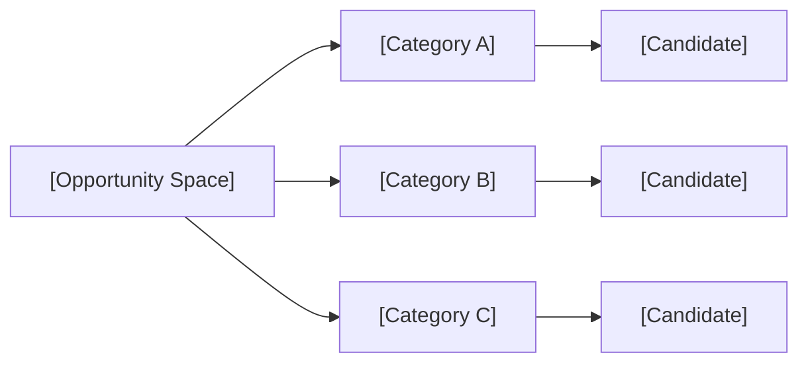
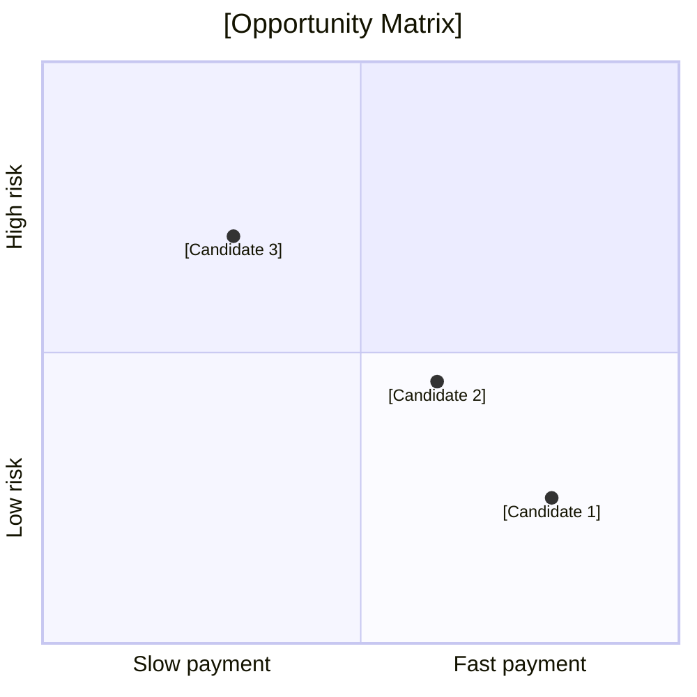

<!-- Generated by ODE -->
# Opportunity Scan Template

Use this template for future opportunity scans. Replace bracketed text with the direction-specific content. Do not remove required sections unless the report is explicitly a lightweight note.

## 1. Decision Summary

Reader: `[who this is for]`  
Decision: `[what decision this report helps make]`  
Time window: `[24h / 7d / 30d / 90d]`  
Constraints: `[budget, skills, geography, risk tolerance, compliance, validation speed]`

One-line conclusion:

> `[main conclusion]`

Main line: `[one direction to validate first]`  
Side line: `[adjacent direction to keep warm]`  
Pivot line: `[what to try if the main line fails]`  
Avoid line: `[what looks attractive but should not be first]`

## 2. Whole Opportunity Map

Include a two-layer map:

- Layer 1: a reader-facing visual asset, such as an image2-generated bitmap, a versioned SVG, or another visual that is easier to scan than a table.
- Layer 2: a machine-readable map or matrix with enough points to show research breadth.

Visual asset:




For broad strategic scans, include at least 20 plotted candidates in a matrix or quadrant chart.



| Tier | Candidate | Buyer | First artifact | Evidence | Current action |
|---|---|---|---|---|---|
| Validate now | `[candidate]` | `[buyer]` | `[artifact]` | `[evidence class]` | `[action]` |
| Validate soon | `[candidate]` | `[buyer]` | `[artifact]` | `[evidence class]` | `[action]` |
| Watch | `[candidate]` | `[buyer]` | `[artifact]` | `[evidence class]` | `[action]` |
| Avoid | `[candidate]` | `[buyer]` | `[artifact]` | `[evidence class]` | `[action]` |

Explain why the main line was selected from the map.

## 3. Evidence Ledger

Local scan:
- `[commands or local source pass]`
- `[key counts and stable clusters]`

External sources:
- `[source 1 and what it supports]`
- `[source 2 and what it supports]`
- `[source 3 and what it supports]`

Evidence classes:

| Claim | Evidence class | Strength | Supports | Does not prove |
|---|---|---|---|---|
| `[claim]` | revenue / pain / trend / compliance / inference | A-E or high/medium/low | `[what it supports]` | `[what it does not prove]` |

## 4. Candidate Ranking

| Rank | Candidate | Buyer | Paid job | First price ask | Channel | Evidence | Risk | Verdict |
|---:|---|---|---|---:|---|---|---|---|
| 1 | `[candidate]` | `[buyer]` | `[job]` | `[price]` | `[channel]` | `[evidence]` | `[risk]` | Validate Payment |

## 5. DBS Dialogue

At least 4 rounds for narrow scans and 5 rounds for broad scans.

### Round 0: Boundary

Builder: `[proposal]`  
Challenger: `[real objection]`  
Revision: `[changed or tightened hypothesis]`  
Judge: `[continue / validate / watch / kill / clarify]`

### Round 1: Language And Buyer

Builder: `[proposal]`  
Challenger: `[real objection]`  
Revision: `[changed or tightened hypothesis]`  
Judge: `[continue / validate / watch / kill / clarify]`

### Round 2: Evidence Quality

Builder: `[proposal]`  
Challenger: `[real objection]`  
Revision: `[changed or tightened hypothesis]`  
Judge: `[continue / validate / watch / kill / clarify]`

### Round 3: Channel And Payment

Builder: `[proposal]`  
Challenger: `[real objection]`  
Revision: `[changed or tightened hypothesis]`  
Judge: `[continue / validate / watch / kill / clarify]`

### Round 4: Delivery And Risk

Builder: `[proposal]`  
Challenger: `[real objection]`  
Revision: `[changed or tightened hypothesis]`  
Judge: `[continue / validate / watch / kill / clarify]`

## 6. Action Plan

### 24-72 Hours

- `[action]`
- `[action]`
- `[action]`

### 7 Days

- `[action]`
- `[action]`
- `[pass/fail gate]`

### 30 Days

- `[action if pass]`
- `[action if fail]`

Pass criteria:
- `[measurable signal]`

Fail criteria:
- `[measurable signal]`

Do not do yet:
- `[tempting but premature work]`

## 7. Appendix

Local commands:

```bash
[commands]
```

Sources:
- `[source]`
- `[source]`
